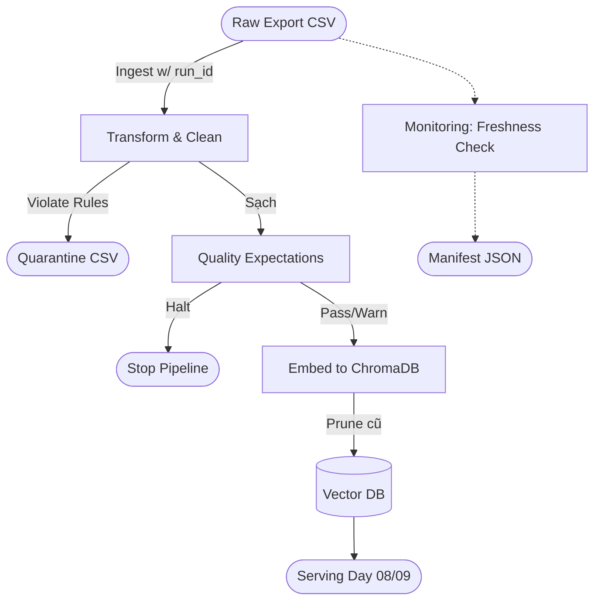

# Kiến trúc pipeline — Lab Day 10

**Nhóm:** Nhóm Data Engineers
**Cập nhật:** 2026-04-15

---

## 1. Sơ đồ luồng (bắt buộc có 1 diagram: Mermaid / ASCII)

---

## 2. Ranh giới trách nhiệm

| Thành phần | Input | Output | Owner nhóm |
|------------|-------|--------|--------------|
| Ingest | policy_export.csv | raw_records, run_id | Phạm Tuấn Anh |
| Transform | raw_records | cleaned_records, quarantine_records | Cleaning Owner |
| Quality | cleaned_records | results, halt flag | Cleaning Owner |
| Embed | valid_records | Upsert DB, Prune cũ | Embed Owner |
| Monitor | meta (age, SLA) | manifest, log status | Monitoring Owner |

---

## 3. Idempotency & rerun

Pipeline được cấu hình đảm bảo Idempotency rủi ro. 
Cơ chế upsert: Việc chèn vào ChromaDB sử dụng hàm `upsert` trên các ID cố định (`chunk_id` sinh bằng SHA-256 nội dung của phần). Do đó, file chạy đi chạy lại sẽ không bị nhân đôi số vector.
Cơ chế prune (Cắt tỉa): Các batch sau khi lưu trữ xong sẽ chạy cơ chế prune để dọn dẹp các ID có trong DB nhưng đã không còn tồn tại trong clean metadata nữa. Log sẽ hiện thị `embed_prune_removed`.

---

## 4. Liên hệ Day 09

Pipeline này khởi tạo / cung cấp corpus sạch cho hệ thống LLM ở Day 08 và Day 09 (sử dụng collection `day10_kb`). Các agent (Supervisor, Worker) trong Day 09 có thể trực tiếp tham chiếu tới Vector DB này thay vì đọc file tĩnh thông qua query thẳng vào RAG layer.

---

## 5. Rủi ro đã biết

- Dữ liệu có thể lọt vào Vector DB nếu kỹ sư cố tình chạy manual pipeline với cờ `--skip-validate`.
- Tính năng đo lường SLA Freshness hiện tại mới chi báo WARN/FAIL (sinh ra manifest JSON) chứ chưa nối cứng để ép pipeline ngắt (halt).
